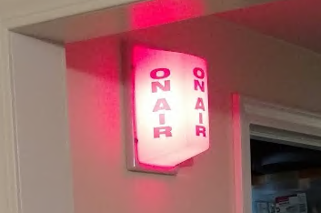

# On Air!

This repo contains client and server applications designed to turn a light on when I'm on a Zoom meeting:

<center></center>

The client or "agent" application runs on my work computer and monitors Zoom, and the server application runs on a Raspberry Pi and raises a GPIO pin when the agent has detected a meeting.  The GPIO pin activates a relay, which provides 110v to the light.

## Hardware

I'm using a Raspberry Pi 2B and a 3 channel relay HAT sold by [Electronics-Salon on Amazon](https://smile.amazon.com/gp/product/B07CZL2SKN).

The light can also be found on [Amazon](https://smile.amazon.com/Triple-Side-Non-Flashing-On-Air-Light/dp/B00JFL0F6Y).

## Server

The server is a simple node/express app, and it listens on port 3000 by default.  The app accepts `POST` calls to `/on` and `/off`, and provides the current state of the light via `GET /status`.

The code is written specifically for the HAT that I'm using.  The three channels on this board map to the following GPIO pins:

|Pin|Channel|
|---|---|
|1|26|
|2|30|
|3|21|

The code assumes that channel 1 is used for the light.  If you use a different HAT or channel you'll need to verify the pin configuration and update `index.js` accordingly.

To get up and running:

* Install node (I'm using the latest LTE)
* Install git
* Clone this repo (`git clone https://github.com/jpdillingham/OnAir`)
* Install dependencies (`npm install`)
* Run with `node index.js`

If you'd like to use a port other than 3000, simply edit `index.js`.

## Agent

The agent has only been proven to work on Windows, where Zoom spawns an executable (`CptHost.exe`) when a meeting begins.  I haven't been able to find an additional process when attending a meeting on Linux, so the process detection method may not work at all.

You'll need a configuration file in the same directory as the executable:

```yaml
processes:
  - CptHost.exe
interval: 5000
webhook: http://192.168.2.31
```

Replace the webhook with the url to your server.

Download the binary from the Releases section; Start it on boot and it will watch for Zoom meetings and update the server accordingly.

Note that the repo also contains a .NET agent; this agent scans for connected webcams and attempts to capture an image from each in an effort to determine whether a camera is actually in use, so that the light would only turn on when video was being shared.  This approach took a lot of time to execute and caused the activity light on each camera to briefly illumniate while the code was probing it.  I've found that the process monitor works just fine.